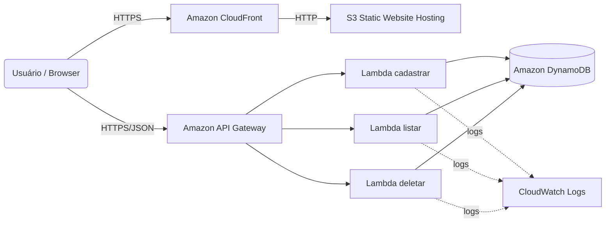

# Site estático no S3 (Terraform)

Projeto: página de cadastro de PETs hospedada no S3 com API em Lambda + API Gateway. Agora distribuída via CloudFront (HTTPS), permitindo reconhecimento de voz no navegador para preencher campos do formulário.

## Arquivos
- `index.html` — página estática com UI e lógica (inclui botões "Transcrever")
- `styles.css` — estilos opcionais (upload manual via CLI)
- `main.tf` — S3, DynamoDB e CloudFront
- `cadastro.tf` — Lambda e API Gateway (cadastrar, listar, deletar)
- `cadastro.py` — função Lambda (cadastrar)
- `deletar.py` — função Lambda (deletar)
- `listar.py` — função Lambda (listar)
- `update-api-url.sh` — injeta URLs/CloudFront no `index.html` e faz upload no S3

## Arquitetura (alto nível)



Arquivo DrawIO (abre no diagrams.net ou extensão Draw.io):
- `architecture.drawio`

Notas:
- O reconhecimento de voz usa a Web Speech API do navegador (pt-BR). Requer contexto seguro (HTTPS) — por isso usamos CloudFront.
- A integração com Amazon Transcribe não está habilitada no front; pode ser adicionada com backend para streaming (opcional).

## Pré-requisitos
- AWS CLI configurado (credenciais ativas)
- Terraform 1.0+
- Permissões para criar S3, CloudFront, DynamoDB, Lambda e API Gateway

## Deploy (CLI)
```bash
cd /Users/abelha/Documents/DEV/reports-app

# 1) Inicializar providers
terraform init

# 2) Aplicar infraestrutura (S3, DynamoDB, Lambdas, API Gateway, CloudFront)
terraform apply -auto-approve

# 3) Injetar URLs de API e domínio do CloudFront no HTML e publicar
chmod +x ./update-api-url.sh
./update-api-url.sh

# 4) (Opcional) Publicar CSS
aws s3 cp styles.css s3://$(terraform output -raw bucket_name)/styles.css --content-type "text/css"
```

Saídas úteis (terraform output):
- `cloudfront_domain` — domínio HTTPS para acessar o site
- `website_url` — endpoint HTTP do S3 (será redirecionado para HTTPS se aberto)
- `api_gateway_url` — endpoint de cadastro (POST)
- `api_gateway_listar_url` — endpoint de listagem (GET)
- `api_gateway_deletar_url` — endpoint de exclusão (DELETE)

## Uso
- Acesse pelo CloudFront: `https://<cloudfront_domain>`
- Preencha os campos ou clique em "🎤 Transcrever" em Nome do Pet, Idade do Pet e Nome do Dono.
- Autorize o uso do microfone quando solicitado.

## Reconhecimento de voz / Transcrição

### Como funciona hoje (Web Speech API, no navegador)
- O site usa a API nativa do navegador (Web Speech API) para reconhecer fala em `pt-BR` e preencher os campos:
  - Botões de transcrição existem ao lado de `Nome do Pet`, `Idade do Pet` e `Nome do Dono`.
  - Ao clicar, o navegador pede permissão para o microfone e começa a escutar; clique novamente para parar.
  - Para `Idade do Pet` há tratamento básico: extrai dígitos do que foi falado e entende números simples por extenso (0–30).
- Requisito de segurança: a API de microfone funciona apenas em contexto seguro (HTTPS) ou `localhost`.
  - Por isso o site é servido via CloudFront (HTTPS). Se você abrir o endpoint HTTP do S3, o front redireciona para o domínio do CloudFront.
- Compatibilidade: suportado em Chrome/Edge/Android. Em iOS/Safari, pode exigir interação mais explícita do usuário e permissões.

### Como habilitar Amazon Transcribe (opcional)
Se você quiser trocar o reconhecimento local do navegador por transcrição na AWS:
1) Componentes sugeridos
   - API Gateway (WebSocket ou HTTP) para receber/encaminhar o áudio do browser.
   - AWS Lambda para intermediar a sessão (assinar requisições, gerenciar sessão, enviar chunks de áudio).
   - Amazon Transcribe (Streaming) para transcrever o áudio em tempo real.
   - Opcional: Amazon Cognito para autenticação no front sem expor credenciais.
2) Fluxo de alto nível
   - Browser captura áudio via `MediaStream` (getUserMedia) e envia pacotes PCM/Opus para a API.
   - Lambda abre sessão de streaming no Transcribe e repassa os frames de áudio.
   - Transcribe retorna resultados parciais/finais; Lambda devolve eventos ao browser (WebSocket) ou resposta incremental.
   - O front atualiza os campos conforme os resultados finais chegam.
3) Ajustes no front-end
   - Substituir a chamada da Web Speech API por uma conexão WebSocket/HTTP com sua API.
   - Serializar áudio (ex.: PCM 16 kHz mono) e enviar; consumir eventos de texto para preencher os inputs.
4) Custos (referência)
   - Transcribe: ~US$ 1,44 por hora de áudio (US$ 0,0004/seg). Verifique preços na sua região.
   - API Gateway/Lambda: baixos em uso leve; variam por número de mensagens/execuções.
5) Segurança
   - Nunca exponha credenciais AWS no front. Utilize Cognito (federado) ou mantenha todo o tráfego de áudio passando pela sua API (assinado no backend).

### Troubleshooting
- Botão mostra "HTTPS necessário": acesse pelo domínio `cloudfront_domain` (HTTPS) ou use `localhost` em ambiente de desenvolvimento.
- Erro `not-allowed`: conceda permissão ao microfone nas configurações do navegador e recarregue a página.
- Não transcreve no iOS/Safari: garanta que o site está em HTTPS e que o gesto do usuário (clique) inicia a captura.
- Idade não preenchida: fale um número claro (ex.: "dez", "vinte e três" ou "12"). O parser cobre 0–30.

## Remover
```bash
terraform destroy
```

## Dicas
- Região padrão: `us-east-1` (ajuste no provider e aplique novamente)
- Para trocar o nome do bucket, altere `bucket` em `main.tf` e rode `terraform apply`
- Se o microfone não funcionar, garanta acesso via HTTPS (CloudFront) e libere permissão no navegador

## Custos (estimativa rápida)
- CloudFront: ~US$ 0,085/GB transferido e ~US$ 0,0075/10k requisições (Price Class 100)
- Web Speech API: sem custo AWS (nativo do navegador)
- Amazon Transcribe (se habilitar no futuro): ~US$ 1,44 por hora de áudio
